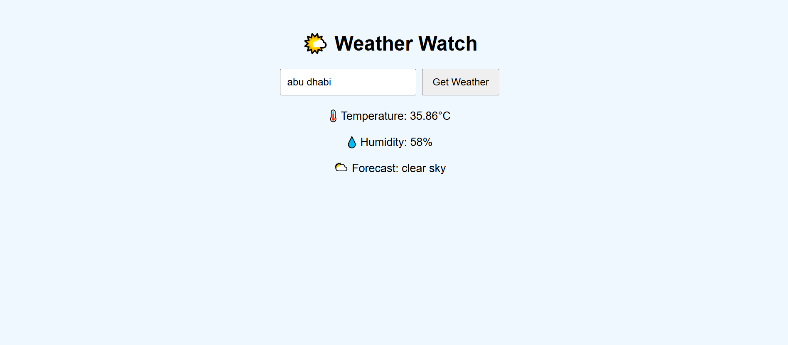

# 🌤️ Weather Watch

A simple weather dashboard that shows real-time weather for any city using the OpenWeatherMap API.

## 💡 Features
- Enter a city name
- Displays:
  - 🌡️ Temperature (°C)
  - 💧 Humidity
  - 🌥️ Weather condition

## 🛠️ Technologies Used
- HTML
- CSS
- JavaScript (Fetch API)
- OpenWeatherMap API

## ▶️ How to Run
1. Download the project or clone the repo
2. Open `index.html` in your browser
3. Enter a city and click “Get Weather”

## 📸 Screenshot

